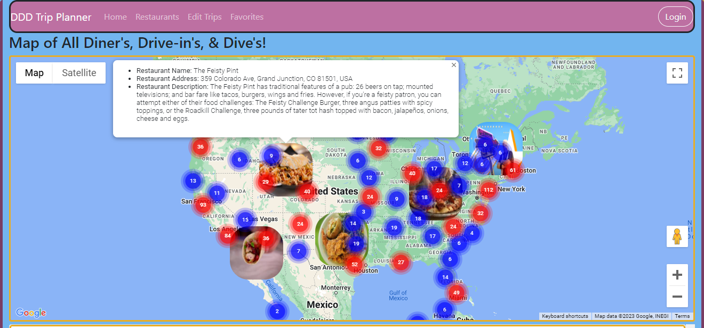
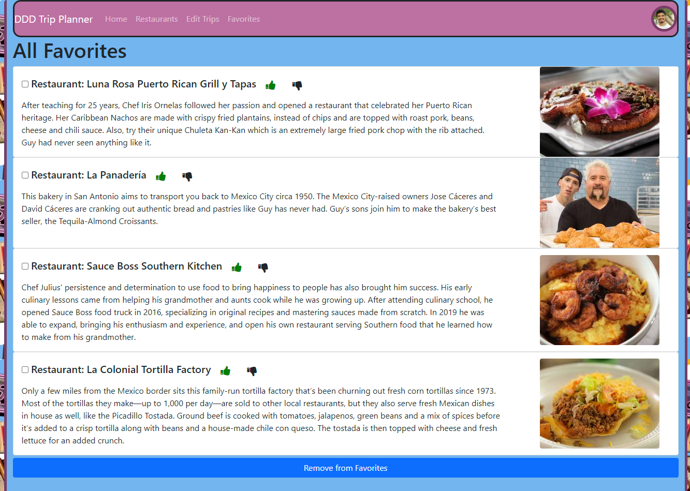
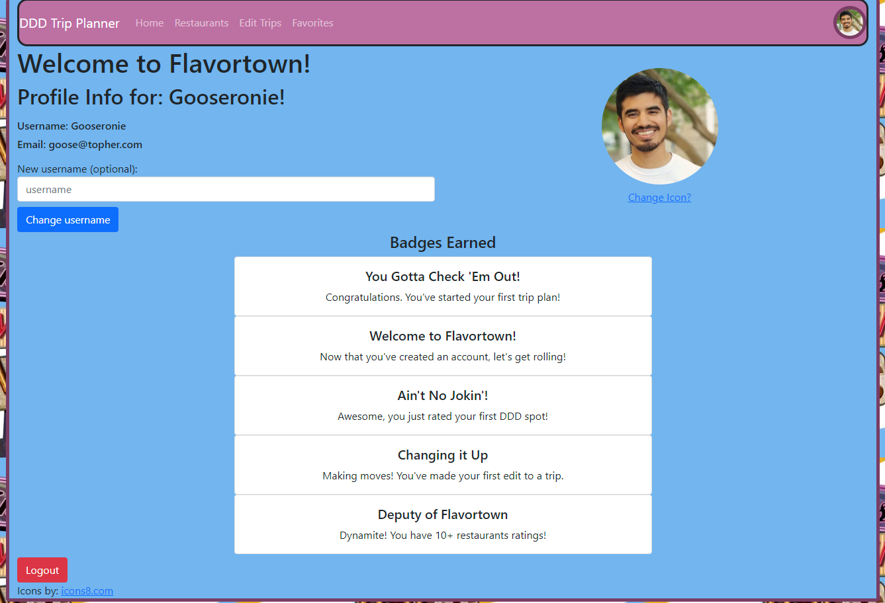
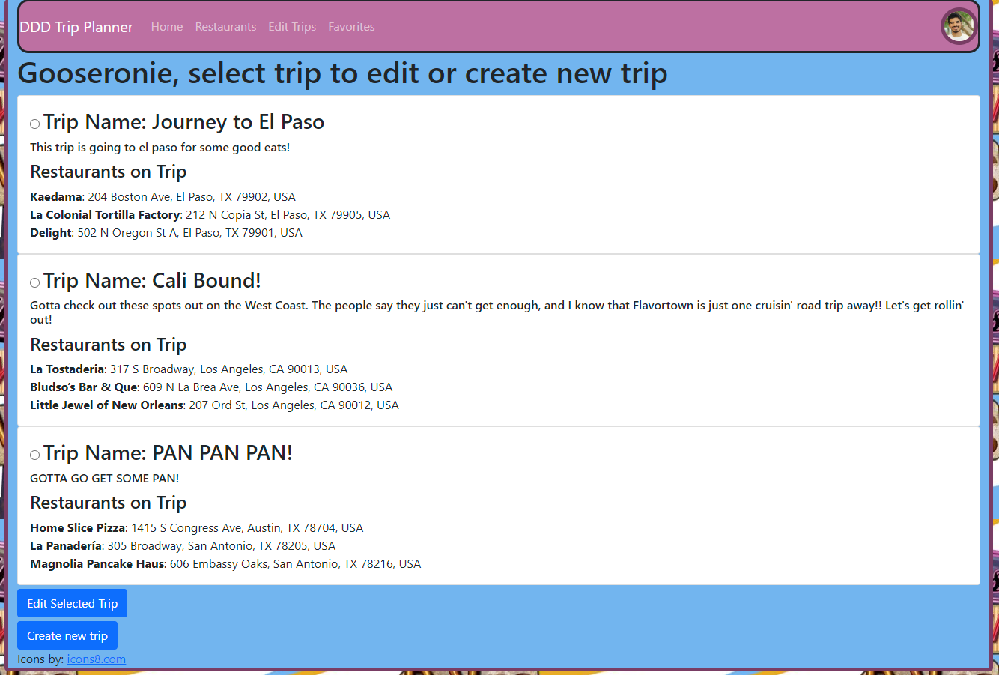
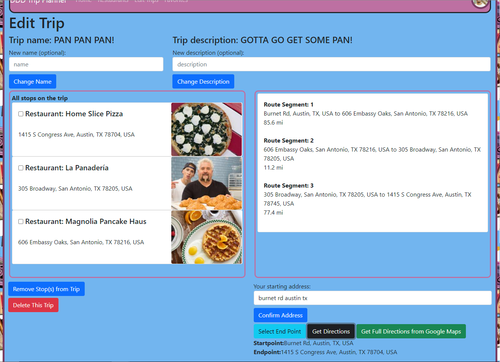
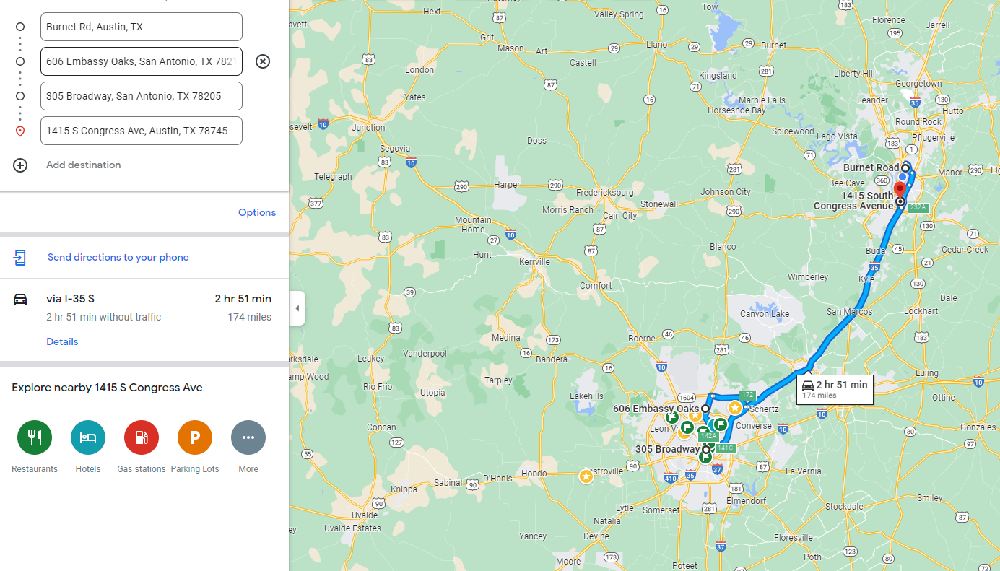

# 

The DDD Trip Planner is a web app with over 1,200 “Diners, Drive-Ins, and Dives” (DDD) restaurants to get rollin' out to! This app offers a detailed map view all of the DDD restaurants 
from Food Network's 86 page list and makes it easy to plan your next trip. Users can create and edit trips, add and remove stops for the trips, earn badges, and favorite and rate restaurants.

The application is currently running with the use of AWS's Amazon Lightsail and Route 53 at dddtripplanner.com.

## Table of Contents

* [Tech Stack](#tech-stack)
* [Features](#features)
* [Setup/Installation](#installation)
* [Future Upgrades](#future)
* [License](#license)

## <a name="tech-stack"></a>Tech Stack

__Frontend:__ HTML5, CSS, Javascript, AJAX, Bootstrap <br/>
__Backend:__ Python, Flask, PostgreSQL, SQLAlchemy <br/>
__APIs/Tools:__ Google Maps Javascript, Google Geocoding, Google Maps URL, BeautifulSoup <br/>

## <a name="features"></a>Features

Any user can view all DDD restaurants on a clustered marker map with detailed information for each restaurant.
  

<br/><br/><br/>
Once logged in, you can favorite and rate restaurants
  

<br/><br/><br/>
Update their profile.


<br/><br/><br/>
Create and edit trips.
  

<br/><br/><br/>
Choose start, end, and get Optimized Directions
  

<br/><br/><br/>
Get directions sent to your phone from Google Maps URL containing optimized waypoints




## <a name="installation"></a>Setup/Installation ⌨️

#### Requirements:

- Python 3.9.18
- BeautifulSoup
- Google Maps Javascript and Google Geocoding API Keys

To have this app running on your local computer, please follow the below steps:

NOTE: APP IS STILL IN PRODUCTION AND SEED STEPS MAY NOT FUNCTION DEPENDING ON WHICH GIT COMMIT YOU PULL

Clone repository:
```
$ git clone https://github.com/cguz14/dddTripPlanner.git
```
Create a virtual environment:
```
$ virtualenv env
```
Activate the virtual environment:
```
$ source env/bin/activate
```
Install dependencies🔗:
```
$ pip3 install -r requirements.txt
```
Request Keys for the [Google Maps Javascript](https://developers.google.com/maps/documentation/javascript/get-api-key) and [Geocoding](https://developers.google.com/maps/documentation/geocoding/get-api-key) APIs.  
If you're placing IP Address/URL Restrictions on the keys, ensure that you have the Maps key restricted via HTTP and the Geocoding key restricted via IP Address.  
Save them to a file `secrets.sh` (don't commit this file!). Your file should look something like this:
```
export SECRETKEY='abc'
export MAPS_KEY='Mapabc'
export GEO_PLACES_KEY='Geoabc'
```
Source your secrets file:
```
$ source secrets.sh
```

Create database 'dddTripPlanner'.
```
$ createdb dddTripPlanner
```
Create your database tables and seed example data.  
#### Important Note: When all 86 pages are seeded to the database, that will be over 1200 calls to the Geocoding API, be cautious of seeding multiple times.
```
$ python3 model.py
$ python3 seed.py
```
The seed will take a few minutes to complete as it scrapes the page data.

Run the app from the command line.
```
$ python3 server.py
```

## <a name="future"></a>Future Upgrades
* Update Map info with Places API information
* Update open/close status and more detailed restaurant information
* Scrape more restaurants from available sources
* Add ability for users to communicate

## <a name="license"></a>License

The MIT License (MIT)
Copyright (c) 2023 Christopher Guzman 

Permission is hereby granted, free of charge, to any person obtaining a copy of
this software and associated documentation files (the "Software"), to deal in
the Software without restriction, including without limitation the rights to
use, copy, modify, merge, publish, distribute, sublicense, and/or sell copies
of the Software, and to permit persons to whom the Software is furnished to do
so, subject to the following conditions:

The above copyright notice and this permission notice shall be included in all
copies or substantial portions of the Software.

THE SOFTWARE IS PROVIDED "AS IS", WITHOUT WARRANTY OF ANY KIND, EXPRESS OR
IMPLIED, INCLUDING BUT NOT LIMITED TO THE WARRANTIES OF MERCHANTABILITY,
FITNESS FOR A PARTICULAR PURPOSE AND NONINFRINGEMENT. IN NO EVENT SHALL THE
AUTHORS OR COPYRIGHT HOLDERS BE LIABLE FOR ANY CLAIM, DAMAGES OR OTHER
LIABILITY, WHETHER IN AN ACTION OF CONTRACT, TORT OR OTHERWISE, ARISING FROM,
OUT OF OR IN CONNECTION WITH THE SOFTWARE OR THE USE OR OTHER DEALINGS IN THE
SOFTWARE.
